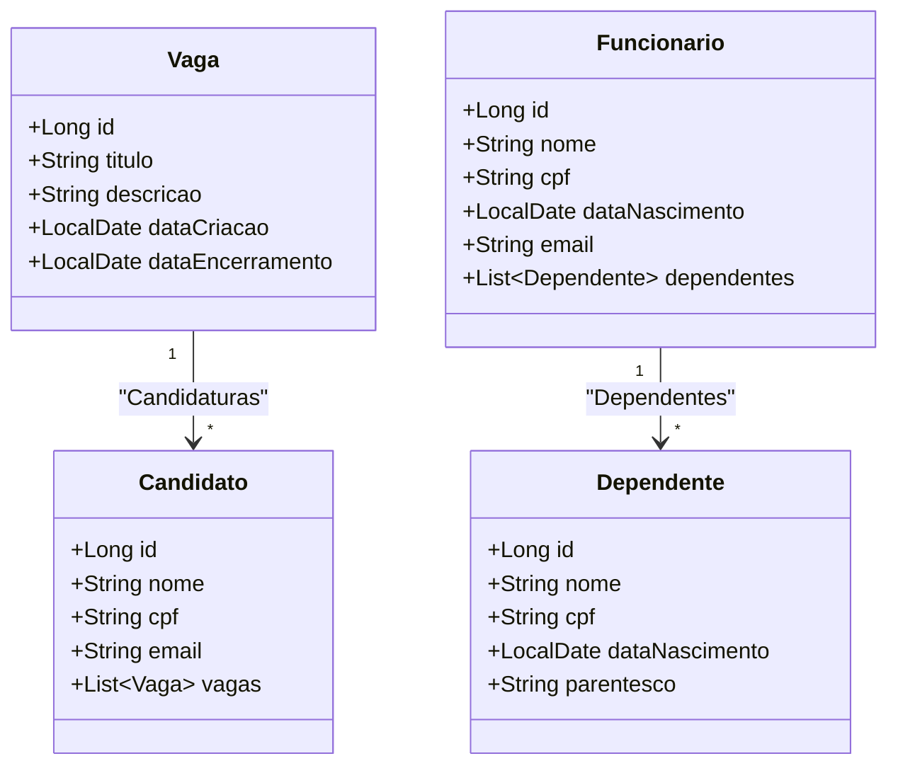

Sistema de RH

Bem-vindo ao Sistema de RH, um projeto desenvolvido para gerenciar vagas, funcionários, dependentes e candidatos. Este sistema utiliza Spring Boot e Thymeleaf para construir uma aplicação web eficiente e fácil de usar.

Funcionalidades Principais

Cadastro de Vagas: Permite a criação, visualização, edição e exclusão de vagas de emprego.
Cadastro de Funcionários: Gerencia o cadastro de funcionários, incluindo a edição e visualização de detalhes.
Gerenciamento de Dependentes: Associa dependentes aos funcionários, com opções de adicionar, editar e excluir dependentes.
Cadastro de Candidatos: Gerencia os candidatos às vagas, incluindo suas informações pessoais e histórico de candidaturas.

Modelo de Dados

Funcionalidades CRUD

Vagas
Criar Vaga: Formulário para cadastro de novas vagas.
Listar Vagas: Visualiza todas as vagas cadastradas.
Editar Vaga: Permite atualizar as informações de uma vaga existente.
Excluir Vaga: Remove uma vaga do sistema.

Funcionários

Cadastrar Funcionário: Formulário para adicionar novos funcionários.
Listar Funcionários: Exibe todos os funcionários cadastrados.
Editar Funcionário: Atualiza os dados de um funcionário existente.
Excluir Funcionário: Remove um funcionário do sistema.

Dependentes

Adicionar Dependente: Formulário para adicionar dependentes aos funcionários.
Listar Dependentes: Visualiza todos os dependentes cadastrados.
Editar Dependente: Atualiza os dados de um dependente.
Excluir Dependente: Remove um dependente do sistema.

Candidatos

Cadastrar Candidato: Formulário para cadastro de novos candidatos.
Listar Candidatos: Exibe todos os candidatos cadastrados.
Editar Candidato: Atualiza os dados de um candidato.
Excluir Candidato: Remove um candidato do sistema.

Tecnologias Utilizadas

Java 17
Spring Boot 3.x
Thymeleaf
Bootstrap
JPA/Hibernate
H2 Database

Contribuições
Sinta-se à vontade para contribuir com o projeto através de pull requests. Todas as contribuições são bem-vindas!
